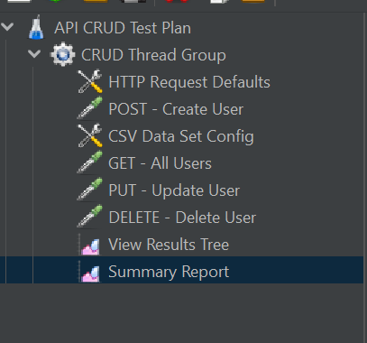
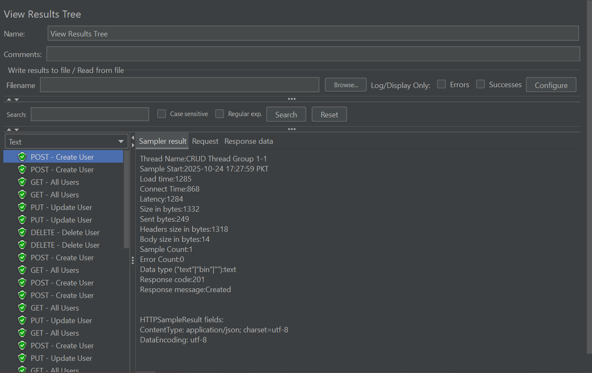
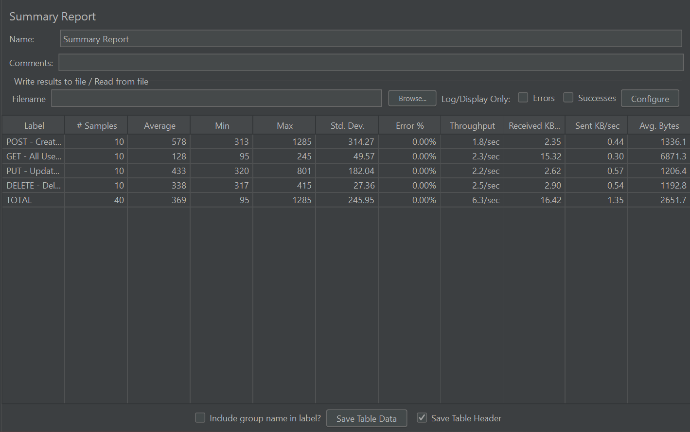

# Assignment 5 - Performance Testing with JMeter

## Overview
This assignment demonstrates API performance testing using Apache JMeter.  
I tested the sample REST API `https://jsonplaceholder.typicode.com` with multiple HTTP methods to analyze response time and throughput.

## Objectives
- Understand and perform load testing using JMeter.
- Configure Thread Groups and HTTP Requests.
- Analyze results and visualize performance reports.

## Tools Used
- Apache JMeter
- JSONPlaceholder (Public Test API)

## Screenshots
### Test Plan Setup

### View Results Tree

### Summary Report

## Author
**Ariha Zainab**  
